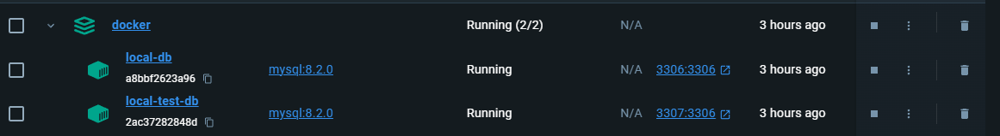
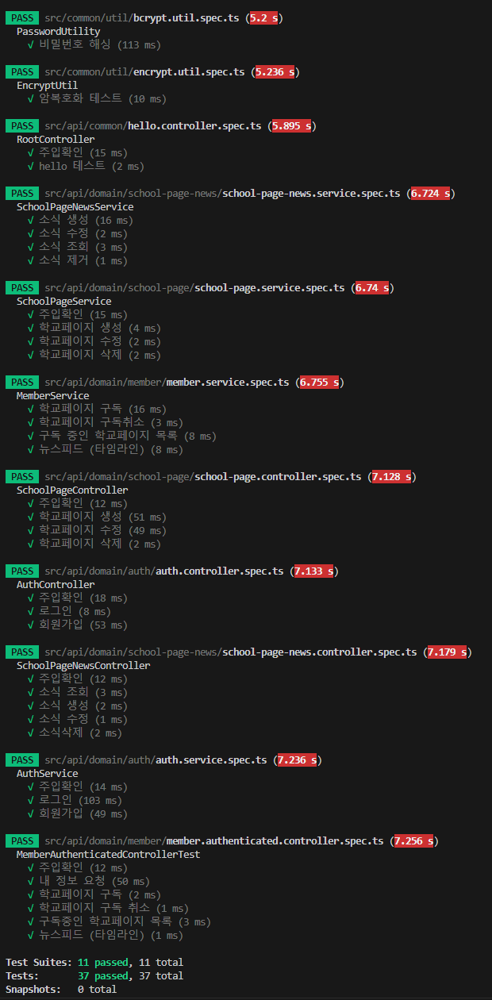
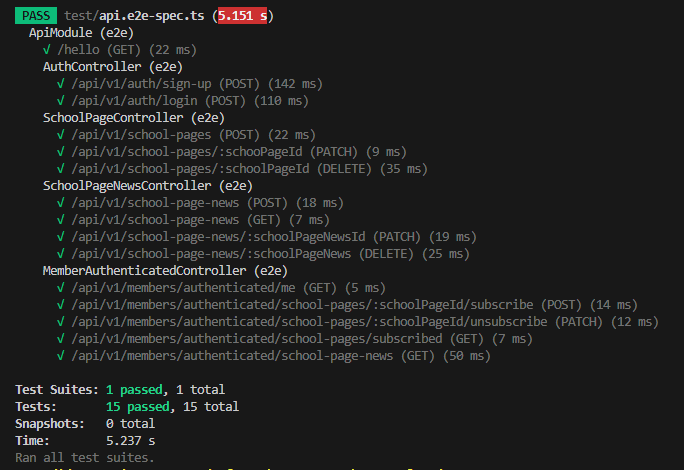
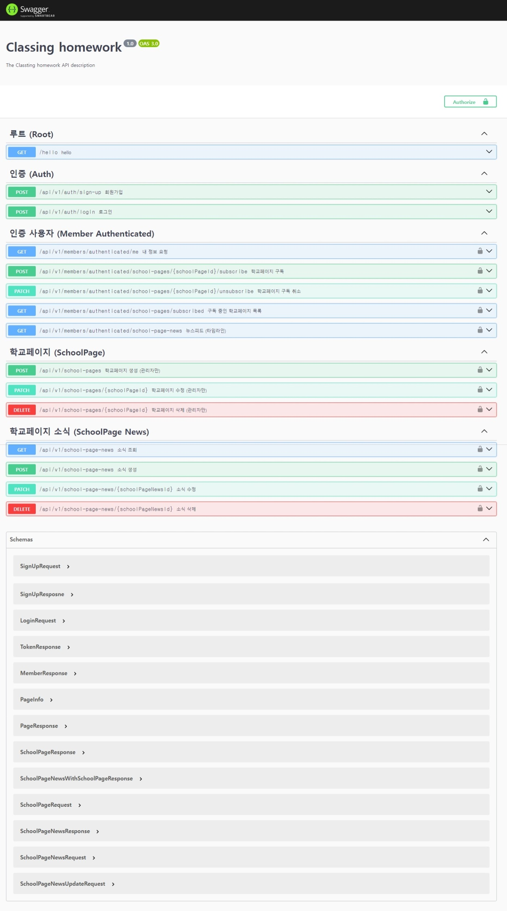

클래스팅 백엔드 과제 (이진석 지원자)

## 🏠 Overview

**소감**

주 언어가 java, spring boot여서 고민이 많았지만 클래스팅에서 표준으로 사용하고 있는 nestjs를 도전해보았다. spring과 유사한 점이 많아서 개발하는데 아주 생소하지는 않았다. nestjs가 최근 우아한형제들에서도 spring과 함께 백엔드 표준으로 자리를 잡았다고 하는데 장점이 많은 것 같았고 이번 기회에 배울 수 있어서 좋은 기회가 되었다.

## 🏛️ Structure

기본적으로 api, core 모듈로 분리하여 개발하였다.

api 모듈은 presentation, application layer, core는 persistency layer 성격을 띈다.

### Api

Auth

- AuthController
- AuthService

SchoolPage

- SchoolPageController
- SchoolPageService

SchoolPageNews

- SchoolPageNewsController
- SchoolPageNewsService

Member

- MemberController
- MemberAuthenticatedController (인증 된 사용자 전용)
- MemberService

### Core

**DB**

SchoolPage

- id
- name
- region

SchoolPageNewsFeed

- id
- schoolPageId
- createdBy
- content

Member

- id
- name
- role (ADMIN, PARENT, STUDENT, TEACHER)

MemberSchoolPageSubscribe

- id
- memberId
- schoolPageId
- subscribedAt
- unsubscribedAt

## 🎢 Tech Stack

node 21.4.0

npm 10.2.4

typescript 5.1.3

typeorm

mysql

swagger

jsonwebtoken

jest

docker

## 📚 Database

DB는 mysql을 사용하였다.

어플리케이션이 실행되기 위해 docker-compose를 구성해놓았다.

아래 명령어로 실행할 수 있다.

어플리케이션 시작전에 반드시 도커 컨테이너가 실행되어야지만 어플리케이션을 실행시킬 수 있다.

```
npm run start:docker
```



## 🧩 Test

전체 service, controller 단위 테스트와 api module 통합테스트를 작성하였고 아래와 같이 실행시킬 수 있다.

**Unit test**

```
npm run test
```



**E2E Test**

```
npm run test:e2e
```



## 🏃 Run Application

```shellscript
npm run start
```



## 🧾 Memo

뉴스피드 불러오기 Native Query

```sql
select
  schoolPageNews.*,
  schoolPage.school_name,
  memberSchoolPageSubscribe.member_id,
  memberSchoolPageSubscribe.created_at,
  memberSchoolPageSubscribe.unsubscribed_at
from school_page_news schoolPageNews
  inner join school_page schoolPage
    on schoolPage.id = schoolPageNews.school_page_id
  inner join member_school_page_subscribe memberSchoolPageSubscribe
    on memberSchoolPageSubscribe.school_page_id = schoolPageNews.school_page_id
where
  memberSchoolPageSubscribe.member_id = ${memberId}
  and schoolPageNews.created_at >= memberSchoolPageSubscribe.created_at
  and
  (
    memberSchoolPageSubscribe.unsubscribed_at is not null
      and schoolPageNews.created_at <= memberSchoolPageSubscribe.unsubscribed_at
    or
    memberSchoolPageSubscribe.unsubscribed_at is null
  )
```
