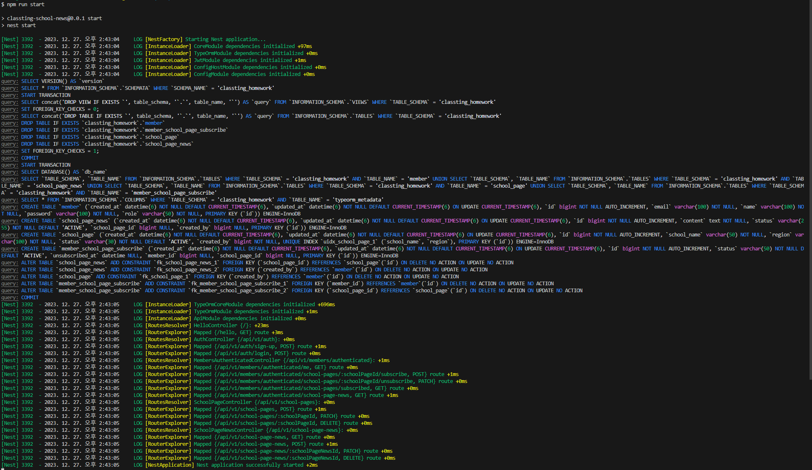

클래스팅 백엔드 과제 (이진석 지원자)

## 🏠 Overview

**소감**

주 언어가 java, spring boot여서 처음에는 spring으로 프로젝트를 시작했지만 클래스팅에서 표준으로 사용하고 있는 nestjs에 도전해보고 싶은 마음이 들어서 nestjs로 개발하게 되었다. spring과 유사한 점이 많아서 개발하는데 아주 생소하지는 않았다.

nestjs가 최근 우아한형제들에서도 spring과 함께 백엔드 표준으로 자리를 잡았다고 하는데 장점이 많은 것 같았고 이번 기회에 배울 수 있어서 좋은 기회가 되었다.

**테스트**

jest에서의 테스트 코드를 짜본 적이 없어서 테스트 코드를 짤수 있을지 걱정이 되었지만 spring에서 사용하는 junit과 철학 자체는 비슷해서 chatgpt에게 물어보면서 테스트 코드도 마무리 지을 수 있었다.

**보안**

인증, 인가는 jsonwebtoken을 사용하고 decorator를 생성하여 컨트롤러단에서 간편하게 사용할 수 있도록 하였다.

**로깅**

winston 로거를 활용하였다. 콘솔로그, 일반 파일로그, 에러 파일로그를 나누어서 관리할 수 있도록 하였다.

winston daily 옵션을 통해서 최대 몇일까지 파일을 보관하는지에 대한 여부를 설정하였다.

## 🏛️ Structure

기본적으로 api, core 모듈로 분리하여 개발하였다.

api 모듈은 presentation, application layer, core는 persistency layer 성격을 띈다.

**DB**

데이터 베이스는 익숙하게 사용해온 mysql을 사용하였다. nest에서 inmemory db가 익숙하지 않아 docker로 mysql container를 띄우는 방식으로 진행하였다.

### Api

Auth

- AuthController
- AuthService

SchoolPage

- SchoolPageController
- SchoolPageService

SchoolPageNews

- SchoolPageNewsController
- SchoolPageNewsService

Member

- MemberController
- MemberAuthenticatedController (인증 된 사용자 전용)
- MemberService

### Core

**DB**

SchoolPage

- id
- schoolName
- region

SchoolPageNews

- id
- schoolPageId
- createdBy
- content

Member

- id
- name
- email
- role (ADMIN, PARENT, STUDENT, TEACHER)

MemberSchoolPageSubscribe

- id
- memberId
- schoolPageId
- subscribedAt
- unsubscribedAt

## 🎢 Tech Stack

node 21.4.0

npm 10.2.4

typescript 5.1.3

typeorm

mysql

swagger

jsonwebtoken

jest

winston

docker

## 📚 Database

DB는 mysql을 사용하였다.

어플리케이션이 실행되기 위해 docker-compose를 구성해놓았다.

아래 명령어로 실행할 수 있다.

어플리케이션 시작전에 반드시 도커 컨테이너가 실행되어야지만 어플리케이션을 실행시킬 수 있다.

```
npm run start:docker
```


## 🧩 Test

전체 service, controller 단위 테스트와 api module 통합테스트를 작성하였고 아래와 같이 실행시킬 수 있다.

**Unit test**

```
npm run test
```


**E2E Test**

```
npm run test:e2e
```


## 🏃 Run Application

실행 스크립트

```shellscript
npm run start
```

3000번 포트로 실행된다



Swagger

http://localhost:3000/api-docs/index.html


## 🧾 Memo

뉴스피드 불러오기 Native Query

```sql
select
  schoolPageNews.*,
  schoolPage.school_name,
  memberSchoolPageSubscribe.member_id,
  memberSchoolPageSubscribe.created_at,
  memberSchoolPageSubscribe.unsubscribed_at
from school_page_news schoolPageNews
  inner join school_page schoolPage
    on schoolPage.id = schoolPageNews.school_page_id
  inner join member_school_page_subscribe memberSchoolPageSubscribe
    on memberSchoolPageSubscribe.school_page_id = schoolPageNews.school_page_id
where
  memberSchoolPageSubscribe.member_id = ${memberId}
  and schoolPageNews.created_at >= memberSchoolPageSubscribe.created_at
  and
  (
    memberSchoolPageSubscribe.unsubscribed_at is not null
      and schoolPageNews.created_at <= memberSchoolPageSubscribe.unsubscribed_at
    or
    memberSchoolPageSubscribe.unsubscribed_at is null
  )
```
